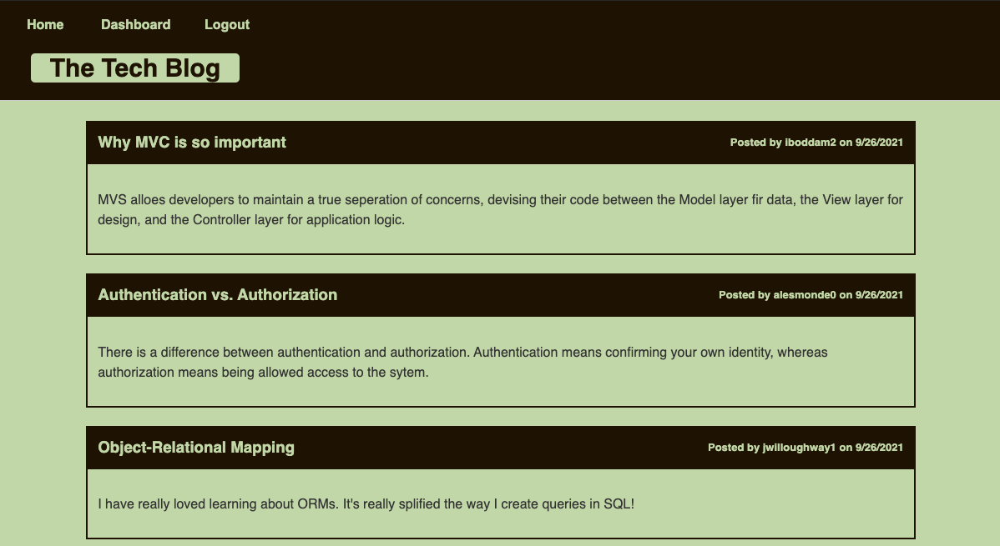

# tech-blog
CMS-style blog following the MVC paradigm in its architectural structure, using Handlebars.js as the templating language, Sequelize as the ORM, and the express-session npm package for authentication.

The blog allows users to log in to create, edit and delete posts. They can also click on any post to see comments as well as comment on the post.

## Technologies
* Node.js
* Express.js
* Sequelize
* Handlebars.js
* Heroku
* JawsDB

## Screenshot

    </img>

## Deployed Link
https://minhha-tech-blog.herokuapp.com/

## GitHub repo
https://github.com/minhhap/tech-blog